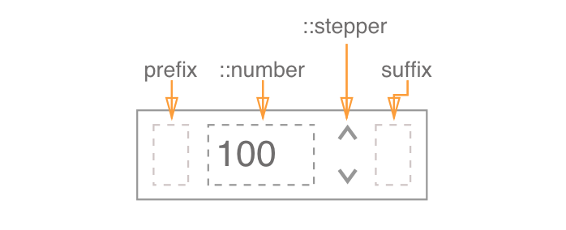

# Number Input

**Number Input** allows  the user to enter a number within a certain range.

Number Input improves upon the native `<input type="number">` by providing the ability to customise stepper arrows design, a common React+Typescript API, and working out the kinks of native implementations.



## Component API

#### Props

| name         | type                             | defaultValue | isRequired | description                              |
| ------------ | -------------------------------- | ------------ | ---------- | ---------------------------------------- |
| value        | number                           |              |            | Used to set & change the value of the input. If you bind this to a state in your parent component, you should also set the onChange handler, in order for the component to work. <br>  If value is empty, component behaves as uncontrolled |
| defaultValue | number                           |              |            | Sets the default value if the input is uncontrolled. |
| placeholder  | string                           |              |            | Text to display if the value is null.    |
| min          | number                           | 1            |            |                                          |
| max          | number                           | 100          |            |                                          |
| step         | number                           | 1            |            |                                          |
| required     | bool                             | false        |            | Whether or not filling the value is required in a form. |
| disabled     | bool                             | false        |            | If true, the component will not be interactable. |
| label        | string                           |              |            | Text to display in accessibility mode.   |
| name         | string                           |              |            | The name of the component. Behaves like the name attribute of an input element. |
| prefix       | node                             |              |            | Inserts a component at the start of the input. |
| suffix       | node                             |              |            | Inserts a component at the end of the input. |
| onChange     | `(event: {value: number}): void` |              |            | Callback function that is fired on component blur. |
| onInput      | `(event: {value: number}): void` |              |            | Callback function that is fired on every keydown event. |
| error        | bool                             | false        |            | Sets the `:error` CSS state on the `<NumberInput>`. |


### Code Examples

#### **Example 1:**

```jsx
import * as React from 'react';
import { NumberInput } from './components/NumberInput';
import style from './style.st.css'; 

export class ComponentsDemo extends React.Component<{}, {}>{
    constructor() {
        super();
    }

    public render() {
    const {basicValue, sharedValue} = this.state;
    return (
      <NumberInput
        value={basicValue}
        step={1}
        min={0}
        max={100}
        onChange={this.handleBasicValueChange}
        placeholder="How Many?"
      />
    }
```

Basic number input with `min` / `max`, `placeholder` and `step`. 


**Example 2:**

```jsx
import * as React from 'react';
import { NumberInput } from './components/NumberInput';
import style from './style.st.css'; 

export class ComponentsDemo extends React.Component<{}, {}>{
    constructor() {
        super();
    }

    public render() {
    const {basicValue, sharedValue} = this.state;
    return (
      <NumberInput
        value={basicValue}
        step={1}
        max={100}
        onChange={this.handleBasicValueChange}
        placeholder="How Many?"
        prefix={</img>}
        suffix={<span>USD</span>}
      />
    }
```

Complex number input with  `prefix` displaying icon and `suffix` displaying "USD" string.


## Style API

#### Subcomponents (pseudo-elements)

| selector        | description                  | type                                     |
| --------------- | ---------------------------- | ---------------------------------------- |
| ::stepper       | Style the stepper            | Style the internal `<Stepper/>` component. ADD LINK. |
| ::stepper::up   | Style the stepper UP arrow   | Style the internal `<Stepper/>` component. ADD LINK. |
| ::stepper::down | Style the stepper DOWN arrow | Style the internal `<Stepper/>` component. ADD LINK. |

#### Custom CSS States (pseudo-classes)

| selector                       | description                              |
| ------------------------------ | ---------------------------------------- |
| :error                         | Style the component on error, i.e. when the `error` prop is true |
| :hover, :focus, :disabled, etc | Standard CSS pseudo classes              |

#### Style Code Examples

**Example 1:**

```css
@import * from './components/slider'; /* TODO: fix the correct syntax */
/* style.st.css
Adding rules here (which may be shared between different components) allows us to override specific parts; or even change the whole theme
*/
NumberInput {
  background: #bada55;
}

NumberInput::stepper {
  background-color: transparent;
}

NumberInput::stepper::down, NumberInput::stepper::up {
  color:blue;
}

NumberInput::stepper::down:hover, NumberInput::stepper::up:hover {
  background-color:lightblue;
}
```

**Example 2:**

```css
/* style example of the basic theme here? */
```

