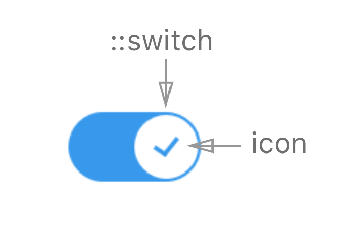

## Toggle

**Toggle** is a component used as an on/off switch.

## Elements



**Toggle** consists of **switch** and **icon**. The **switch** moves across the body of the **Toggle** component in order to set the value to **on** (`true`) or **off** (`false`). The **icon** indicates the state of the value.

## Component API

### Props

| name     | type   | defaultValue | isRequired | description                              |
| -------- | ------ | ------------ | :--------- | ---------------------------------------- |
| value    | boolean   | false     |            |                                          |
| onChange | function |      |   | Callback function invoked when user changes the value of the component. <br> `(event: {value: boolean}): void` |
| required | boolean  | false      |            | If `true`, the value must be defined. |
| name     | string |              |            | The name of the instance of the component. Behaves like the name attribute of an input element. |
| disabled | boolean   | false     |       | If `true`, the toggle will not be interactive. |
| label    | string |          |            | Text to display in accessibility mode.    |
| error    | boolean   | false   |       | Sets the `:error` CSS state on the component. |

### Code examples

##### Example 1

```jsx
import * as React from 'react';
import {Toggle} from './components/toggle';
import style from './style.st.css'; // link to Style file - see examples of style files below

type State = {
  toggleValue: boolean
}

export class ComponentsDemo extends React.Component<{}, State>{
  public state = {
    toggleValue: false
  }

  public render() {
    return <Toggle
      value={this.state.toggleValue}
      onChange={e => this.setState({toggleValue: e.value})}
    />;
  }
}
```

## Style API

### Subcomponents (pseudo-elements)

| selector | description          | type               |
| -------- | --------------- | ----------------------- |
| ::switch | Style the switch of **Toggle**. | HTML Element. This subcomponent has no subcomponents of its own. |

You can add icons to the `::switch` subcomponent by setting the `background-image` property.

### Custom CSS States (pseudo-classes)

| state             | description                              |
| ------------------------------ | --------------------------- |
| :error            | Style the component on error, i.e. when the `error` prop is true. |
| :checked          | Style the toggle element in checked state. |
| :hover, :focus, :disabled, etc | Standard CSS states.           |

### Style Code Examples

##### Example 1

```css
@import * from './components/toggle'; /* TODO: fix the correct syntax */
/* style.st.css
Adding rules here (which may be shared between different components) allows us
to override specific parts; or even change the whole theme
*/

Toggle {
  background-color: grey; /* styles the toggle in unchecked state */
}

Toggle:checked {
  background-color: blue; /* styles the togle in checked state */
}

Toggle::switch {
  background-color: white; /* styles the switch bg */
}

Toggle::switch {
    background-image: url('unckecked-icon.svg'); /* adds icon for unchecked state */
}

Toggle:checked::switch {
    background-image: url('ckecked-icon.svg'); /* adds icon for checked state */
}

```
